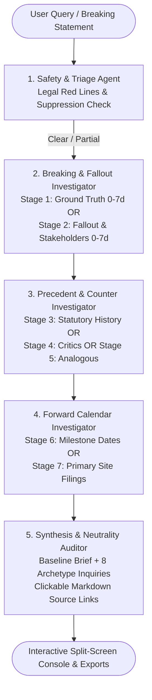

# 🌐 Real-Time News Intelligence & Scenario Analysis Multi-Agent Platform

An autonomous, multi-agent intelligence console built strictly on the **Google Agent Development Kit (ADK)** (`google-adk`, [https://adk.dev/](https://adk.dev/)), powered by **Google Gemini LLMs** and the **Parallel Web Search API**.

The platform ingests breaking headlines, policy circulars, or corporate events, enforces legal & safety red-line triage (including Sub Judice, Defamation under BNS, SEBI/RBI regulations), executes context-driven web searches under a **strict 1-tool-call budget per agent**, captures **live callback-based observability telemetry**, and synthesizes:
1. A date-grounded **Baseline Intelligence Brief**.
2. **10 to 20 high-signal Speculative & Strategic Inquiries** across 8 distinct archetypes with clickable source links.

---

## 🏛️ Architecture & Multi-Agent Workflow



### 5 Specialized ADK Agents

| Agent | ADK Class | Responsibility | Output State Key |
| :--- | :--- | :--- | :--- |
| **1. Safety & Triage** | `LlmAgent` | Evaluates Universal Red Lines (emergencies, personal health, penny stocks, uncharged crimes) & Jurisdiction Legal Red Lines (Sub Judice, Defamation, Communal Harmony, SEBI/RBI). Emits `FULL_SUPPRESSION`, `PARTIAL_SUPPRESSION`, or `NO_SUPPRESSION`. | `safety_result` |
| **2. Breaking & Fallout** | `LlmAgent` | Evaluates context and executes 1 search call (Stage 1: Ground Truth or Stage 2: Immediate Fallout). | `stages_1_2` |
| **3. Precedent & Counter** | `LlmAgent` | Evaluates context and executes 1 search call (Stage 3: Precedent, Stage 4: Critics/Dissent, or Stage 5: Analogous Base Rates). | `stages_3_5` |
| **4. Forward Calendar** | `LlmAgent` | Evaluates context and executes 1 search call (Stage 6: Forward Calendar Dates or Stage 7: Primary Source Gazettes/Circulars). | `stages_6_7` |
| **5. Synthesis & Audit** | `LlmAgent` | Generates date-grounded **Baseline Intelligence Brief** and 10–20 **Speculative Inquiries** with clickable source links, enforcing strict neutrality. | `synthesis_output` |
| **Orchestrator** | `SequentialAgent` | Composes the 5 agents into a deterministic ADK execution pipeline. | `session.state` |

---

## 📊 Where to See Agent Observability & Tracking

The system provides **three transparent ways** to observe and inspect what each agent did, what tools were called, argument parameters, execution latencies, and output states:

### 1. Live Streamlit Split-Screen UI
When you run the Streamlit app (`uv run streamlit run app.py`):
* **Left Screen: 🔍 Live Multi-Agent Workspace**
  * **Agent Execution Cards**: Collapsible sections for each of the 5 agents showing:
    * **Active Status**: `PENDING`, `RUNNING`, `COMPLETED`, `WARNING`, `SUPPRESSED`.
    * **Execution Duration**: Precise agent runtime in seconds (e.g. `• 1.42s`).
    * **Tool Executions (1-Call Budget)**: Exact search tool chosen by the agent, latency in milliseconds, input arguments JSON, and returned result summaries.
    * **LLM Calls**: Model name (`gemini-2.5-flash`), prompt snippets, response previews, and latency.
    * **Output State**: State keys produced and stored in `session.state`.
  * **7-Stage Evidence Explorer**: Inspect search queries sent to Parallel API and raw article excerpts.
  * **ADK Pipeline Telemetry Drawer**: Summary metrics (Total Duration, Tool Calls, Model Calls, Pipeline Health).
  * **💾 Download Observability Trace JSON**: 1-click download of the complete Pydantic telemetry trace file.

* **Right Screen: 📋 Synthesized Intelligence Brief**
  * Date-grounded Baseline Brief.
  * 10–20 Speculative Inquiries with **clickable inline source links** (e.g., `*(source: [Stage 1](https://...))*`).
  * Dedicated **Verified Source References** list.

### 2. Terminal & Console Logs
During pipeline execution, real-time structured logs are emitted to the terminal:
```text
[ADK Observability] ▶ Starting Agent: Safety_Triage_Agent
[ADK Observability] ⏹ Completed Agent: Safety_Triage_Agent
[ADK Observability] ▶ Starting Agent: Breaking_Fallout_Investigator
[ADK Observability] ⚡ Invoking Tool: `search_stage_1_ground_truth` for Agent: `Breaking_Fallout_Investigator` (Call #1)
[ADK Observability] ⏹ Completed Agent: Breaking_Fallout_Investigator
[ADK Guardrail] 🛑 Agent 'Breaking_Fallout_Investigator' exceeded tool call budget (max 1) -> Intercepted
```

### 3. Programmatic Telemetry (`PipelineObservabilityReport`)
Exported in Python or downloaded as JSON:
```json
{
  "pipeline_name": "NewsIntelligencePipeline",
  "topic": "RBI digital lending guidelines",
  "total_duration_seconds": 6.84,
  "total_tool_calls": 3,
  "total_model_calls": 5,
  "agent_traces": {
    "Breaking_Fallout_Investigator": {
      "agent_name": "Breaking_Fallout_Investigator",
      "status": "completed",
      "duration_seconds": 1.85,
      "tool_calls": [
        {
          "tool_name": "search_stage_1_ground_truth",
          "arguments": {"topic": "RBI digital lending", "custom_focus": "NBFC capital norms"},
          "duration_ms": 420.5,
          "result_summary": "RBI issues master direction on digital lending..."
        }
      ]
    }
  }
}
```

---

## 🔍 Contextual Search Framework (1-Call Budget per Agent)

Each search agent evaluates the topic and context to execute **exactly one** high-value search stage:

| Stage | Target Window | Focus / Objective | Primarily Feeds |
| :--- | :--- | :--- | :--- |
| **1. Breaking Ground Truth** | Strict: 0–7 days | Primary event, official filings, regulatory orders, PIB statements | Baseline Brief |
| **2. Immediate Fallout** | Strict: 0–7 days | Market reactions, sectoral impact, official counter-statements | Baseline Brief; Second-Order Impact |
| **3. Precedent & Regulatory** | All-time | Statutory history, tribunal doctrines, policy cycles, root causes | Statutory context; Precedent Base Rates |
| **4. Adversarial / Counter** | 0–30 days | Critics, opposing stakeholders, competitors, dissenting officials | "Why X?" Incentives & Timing |
| **5. Analogous / Cross-Domain** | All-time | Structurally similar cases in other sectors/countries + base rates | "Blindspot / What If" Tail Risks |
| **6. Forward Calendar** | Now–90 days | Concrete near-term dates: hearings, earnings, regulatory deadlines | "What to Watch" Leading Indicators |
| **7. Primary Source Filings** | Conditional | Direct official filings (`site:pib.gov.in`, `site:sebi.gov.in`, `site:rbi.org.in`) | Primary citation grounding |

---

## 🎯 8 Speculative & Strategic Inquiry Archetypes

Each generated inquiry is a single, falsifiable sentence traceable to a search stage:
1. **The "Why X?" (Incentives & Strategic Timing)** — *fed by Stage 4*
2. **The "What It Means" (Second-Order Impact)** — *fed by Stage 2*
3. **The "Who Benefits / Who Loses" (Distributional Impact)** — *fed by Stage 2/4*
4. **The "Blindspot / What If" (Tail Risks & Base Rates)** — *fed by Stage 5*
5. **The "What Doesn't Add Up" (Inconsistency Probe)** — *fed by conflicting stages*
6. **The "What to Watch" (Leading Indicators & Concrete Dates)** — *fed by Stage 6*
7. **The "Precedent Says" (Historical Base-Rate Check)** — *fed by Stage 3/5*
8. **The "Cross-Border / Cross-Sector Spillover"** — *fed by Stage 5*

---

## 🚀 Getting Started

### 1. Prerequisites
* Python `>=3.10`
* [uv](https://docs.astral.sh/uv/) package manager

### 2. Environment Setup
Create or update your `.env` file in the root directory:

```bash
# .env
GEMINI_API_KEY=your_gemini_api_key_here
PARALLEL_API_KEY=your_parallel_api_key_here
```

### 3. Install Dependencies
Dependencies are managed with `uv`:

```bash
uv sync
```

---

## 🖥️ Running the Application

Start the Streamlit split-screen application:

```bash
uv run streamlit run app.py
```

Open `http://localhost:8501` in your browser.

---

## 🧪 Running Unit Tests

Run the complete offline test suite (prompt loading, schemas, ADK tool wrapping, 1-call guardrail, formatting):

```bash
uv run python -m unittest discover tests -v
```

---

## 📂 Project Structure

```
spec-agents/
├── README.md                      # Documentation & Observability guide
├── pyproject.toml                 # Dependencies & project metadata
├── .env                           # API keys
├── master_prompt.md               # Master reference prompt & institutional rules
├── parallel_client.py             # Parallel Search API client
├── app.py                         # Split-Screen Streamlit app with live telemetry
├── prompts/                       # Dedicated Agent Prompts Directory
│   ├── __init__.py
│   ├── loader.py                  # Pydantic PromptRegistry with caching & formatting
│   ├── safety_agent.md            # Agent 1 prompt (Legal red-lines & suppression)
│   ├── breaking_agent.md          # Agent 2 prompt (Stages 1-2 & 1-call budget)
│   ├── precedent_agent.md         # Agent 3 prompt (Stages 3-5 & 1-call budget)
│   ├── calendar_agent.md          # Agent 4 prompt (Stages 6-7 & 1-call budget)
│   └── synthesis_agent.md         # Agent 5 prompt (Brief & 8 Archetypes)
├── schemas/
│   ├── __init__.py
│   └── models.py                  # Pydantic domain, findings & observability models
├── observability/                 # ADK Telemetry & Tracing Package
│   ├── __init__.py
│   └── tracker.py                 # ADK Callback hooks (before/after agent, tool, model)
├── tools/
│   ├── __init__.py
│   ├── search_tool.py             # Search query generators & citation consolidators
│   └── adk_tools.py               # Google ADK FunctionTools wrapping Parallel API
├── agents/
│   ├── __init__.py
│   ├── guardrails.py              # Hardcoded tool budget callback guardrails
│   ├── safety_agent.py            # ADK LlmAgent for Safety Triage
│   ├── breaking_agent.py          # ADK LlmAgent for Ground Truth & Fallout
│   ├── precedent_agent.py         # ADK LlmAgent for Precedent & Counter
│   ├── calendar_agent.py          # ADK LlmAgent for Calendar & Primary Sources
│   ├── synthesis_agent.py         # ADK LlmAgent for Synthesis & Neutrality Audit
│   └── pipeline.py                # Assembles ADK SequentialAgent and InMemoryRunner
├── ui/
│   ├── __init__.py
│   ├── components.py              # Split-screen components, telemetry inspector, citations
│   └── styles.py                  # Clean, minimalist dark styling
└── tests/
    ├── test_pipeline.py           # Offline unit tests for queries & formatting
    └── test_adk_pipeline.py       # Offline unit tests for ADK agents, prompts & guardrails
```
